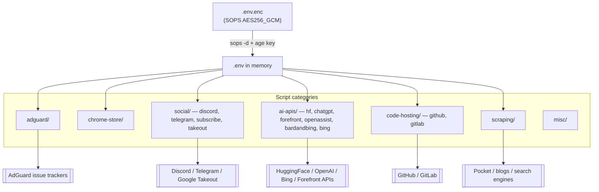

# automation-scripts

> Personal collection of one-off automation and scraping scripts — AdGuard filter tooling, Chrome Web Store scraping, Discord/Telegram bots, AI-API clients, Google Takeout, Pocket bulk-add, and misc utilities. Secrets managed via sops + age.

[](https://github.com/chirag127/automation-scripts/blob/main/LICENSE)
[](https://github.com/chirag127/automation-scripts/stargazers)
[](https://github.com/chirag127/automation-scripts/commits)
[](https://www.python.org/)

## What it is / why it exists

A grab-bag of small, single-purpose Python scripts accumulated over time — the kind of one-off automation that would otherwise get lost in a scratch folder. Each lives under a category directory (bots, AI-API clients, scrapers, filter tooling) and can be run standalone. Anything that needs a credential reads it from a **sops+age-encrypted** `.env.enc`, so the repo stays public and clean while the secrets stay encrypted at rest.

Large output assets (PDFs, screenshots, scraped text) are published in [Releases](https://github.com/chirag127/automation-scripts/releases/tag/assets-v1), not committed to the tree.

## Links

- Repo: [github.com/chirag127/automation-scripts](https://github.com/chirag127/automation-scripts)
- Release assets: [assets-v1](https://github.com/chirag127/automation-scripts/releases/tag/assets-v1)

## ⭐ Star this repo

If this is useful, please ⭐ star the repo — it helps others find it.

## How it works



## Categories

| Folder | What it does | Env vars needed |
|---|---|---|
| `adguard/` | Submit AdGuard filter issues, auto-add custom filters, AdGuard issue reporters | — |
| `chrome-store/` | Scrape Chrome Web Store extension update dates | — |
| `social/discord/` | Discord math bot, Discord prompt sender | `DISCORD_BOT_TOKEN` |
| `social/telegram/` | Telegram bot (placeholder) | — |
| `social/subscribe/` | Auto-subscribe AdGuard filter lists | — |
| `social/takeout/` | Automate Google Takeout export | — |
| `ai-apis/api_hf/` | HuggingFace Bloom/InCoder API clients, OpenAI completion helper, Bing+SayHello search | `BING_API_KEY`, `OPENAI_API_KEY` |
| `ai-apis/chatgpt/` | ChatGPT UI prompt sender via pyautogui | — |
| `ai-apis/forefront/` | Forefront GPT-J API client | — |
| `ai-apis/openassist/` | Open-Assistant UI prompt sender | — |
| `ai-apis/bardandbing/` | Bard/Bing Discord bot prompt sender | — |
| `ai-apis/bing/` | Bing auto-search tab opener | — |
| `code-hosting/github/` | GitHub comment automation | — |
| `code-hosting/gitlab/` | GitLab screenshot reference | — |
| `deepnote/` | Automate Deepnote workspace + project creation via pyautogui | — |
| `scraping/` | Blog scraper, Pocket URL bulk-add, search_all Bing opener | `POCKET_CONSUMER_KEY`, `POCKET_ACCESS_TOKEN` |
| `misc/` | Speedtest loop, graph coloring algo, scratch utilities | — |

## Tech stack

- **Python 3** — all scripts
- Common libs: `requests`, `pyautogui` (UI automation), Discord/Telegram bot SDKs, AI-provider HTTP clients
- **sops + age** for secret management (`.env.enc`, `.sops.yaml`, `.env.example`)

## Repo structure

```
automation-scripts/
├── adguard/           # AdGuard filter issue tooling
├── chrome-store/      # Chrome Web Store scraping
├── social/            # discord/, telegram/, subscribe/, takeout/
├── ai-apis/           # api_hf/, chatgpt/, forefront/, openassist/, bardandbing/, bing/
├── code-hosting/      # github/, gitlab/
├── deepnote/          # Deepnote workspace automation
├── scraping/          # blog scraper, Pocket bulk-add, search openers
├── misc/              # scratch utilities
├── .env.enc           # SOPS-encrypted secrets (AES256_GCM) — safe to commit
├── .env.example       # key names + purpose, no values
├── .sops.yaml         # sops creation rules
└── LICENSE            # MIT
```

## Quick start

```bash
git clone https://github.com/chirag127/automation-scripts.git
cd automation-scripts

# decrypt secrets (requires the age private key at ~/.config/sops/age/keys.txt)
sops -d .env.enc > .env

# run any script, e.g.
python scraping/pocket_bulk_add.py
```

## Configuration

Copy `.env.example` to `.env` and fill in your values. Names + purpose only:

| Env var | Purpose |
|---|---|
| `DISCORD_BOT_TOKEN` | Auth token for the Discord bots (`social/discord/`) |
| `BING_API_KEY` | Bing Search API key for the AI search helpers (`ai-apis/api_hf/`) |
| `OPENAI_API_KEY` | OpenAI API key for the completion helper (`ai-apis/api_hf/`) |
| `POCKET_CONSUMER_KEY` | Pocket app consumer key for bulk-add (`scraping/`) |
| `POCKET_ACCESS_TOKEN` | Pocket user access token for bulk-add (`scraping/`) |

Re-encrypt after editing:

```bash
sops --encrypt --input-type dotenv --output-type dotenv .env > .env.enc
```

## Security

- **No plaintext secrets in the repo.** All secrets live in `.env.enc`, encrypted with **sops + age** (`AES256_GCM`). Decrypt requires the age private key (kept in a password manager, never committed).
- `.env.example` documents key **names and purpose only** — never values.
- The decrypted `.env` is git-ignored; only the encrypted `.env.enc` is tracked.
- `PUBLIC_*`-style values (if any) are client-only.

## Part of the oriz family

automation-scripts is one of ~80 sites and tools in the **oriz** family. See [blog.oriz.in](https://blog.oriz.in) for the rest.

## Contributing

Issues and PRs welcome. Conventional commits are the changelog.

## License

MIT © Chirag Singhal.

## Author

Chirag Singhal · [chirag@oriz.in](mailto:chirag@oriz.in)

## Status / roadmap

Ongoing scratch collection — scripts are added as needs arise. Individual scripts range from stable to experimental; treat each as a self-contained one-off.
