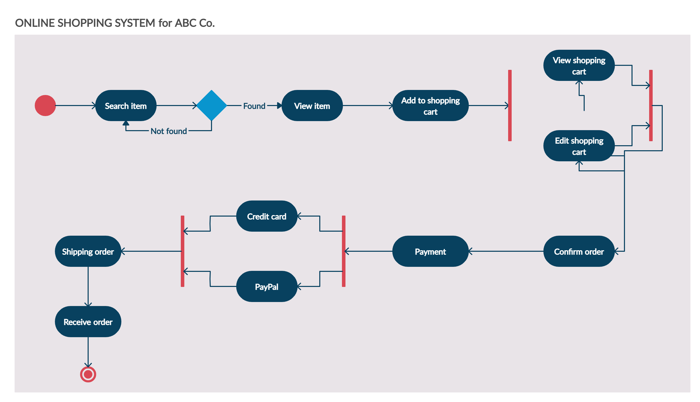

# Experiment 3

## Aim

Draw the activity diagram.

## Activity Diagram for a Online Shopping System

## Conclusion

In this experiment, we have learnt how to draw an activity diagram for a online shopping system.
