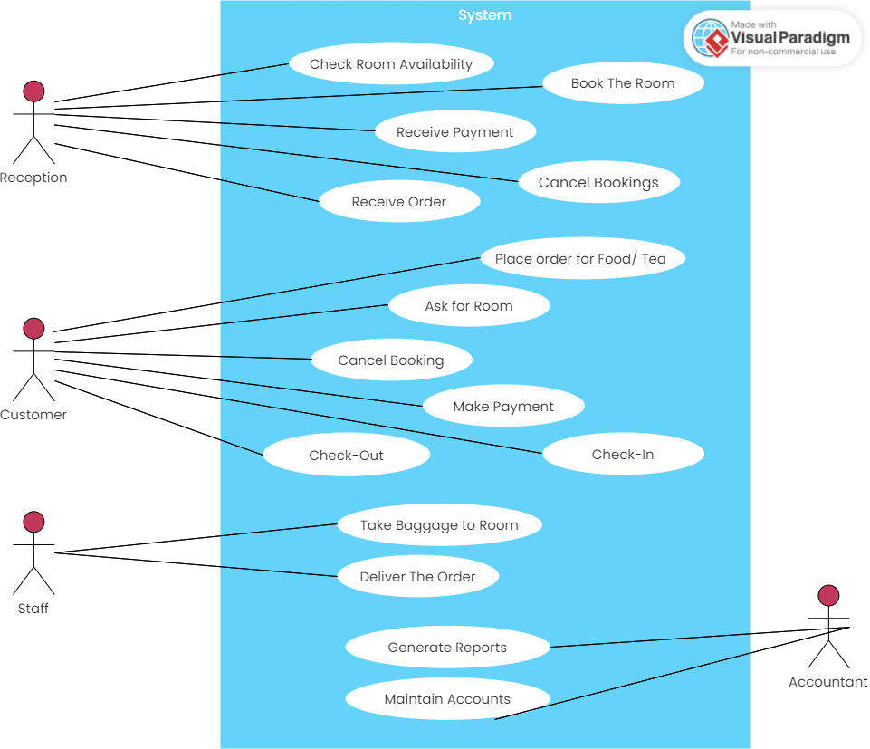

# Experiment 2

## Aim

Draw the use case diagram and specify the role of each of the actors. Also state the precondition, post condition and function of each use case.

## Use Case Diagram

<!--

# Reception
Check Room Availability

Book The Room

Receive Payment

Receive Order

Cancel Bookings

# Customer

Place order for Food/Tea

Ask for Room

Cancel Booking

Make Payment

Check-Out

Check-In

# Staff

Deliver The Order

Take Baggage to Room

# Accountant

Generate Reports

Maintain Accounts

-->

## Specifing the role of each actor

### Customer

The customer is the person who is going to use the hotel management system. The customer can place an order for food and tea, ask for a room, cancel the booking, make payment, check-in and check-out.

### Reception

The reception is the person who is going to use the hotel management system. The reception can check room availability, book the room, receive payment, receive order and cancel bookings.

### Staff

The staff is the person who is going to use the hotel management system. The staff can deliver the order and take baggage to room.

### Accountant

The accountant is the person who is going to use the hotel management system. The accountant can generate reports and maintain accounts.

## Use Case Specification

### Use Case 1: Check Room Availability

#### Precondition

- The reception is logged in to the system.

#### Postcondition

- The reception can see the room availability.

#### Function

The function of this use case is to check the room availability.

### Use Case 2: Book The Room

#### Precondition

- The reception is logged in to the system.
- The room is available.
- The customer has asked for a room.

#### Postcondition

- The room is booked.

#### Function

The function of this use case is to book the room.

### Use Case 3: Receive Payment

#### Precondition

- The reception is logged in to the system.
- The customer has made the payment.

#### Postcondition

- The payment is received.

#### Function

The function of this use case is to receive the payment.

### Use Case 4: Receive Order

#### Precondition

- The reception is logged in to the system.
- The customer has placed an order.

#### Postcondition

- The order is received.

#### Function

The function of this use case is to receive the order.

### Use Case 5: Cancel Bookings

#### Precondition

- The reception is logged in to the system.
- The customer has cancelled the booking.

#### Postcondition

- The booking is cancelled.

#### Function

The function of this use case is to cancel the bookings.

### Use Case 6: Place order for Food/Tea

#### Precondition

- The customer needs food and tea.

#### Postcondition

- The order is placed.

#### Function

The function of this use case is to place order for food and tea.

### Use Case 7: Ask for Room

#### Precondition

- The customer needs a room.

#### Postcondition

- The room is asked for.

#### Function

The function of this use case is to ask for a room.

### Use Case 8: Cancel Booking

#### Precondition

- The customer is not going to stay in the hotel.

#### Postcondition

- The booking is cancelled.

#### Function

The function of this use case is to cancel the booking.

### Use Case 9: Make Payment

#### Precondition

- The customer wants to make the payment.

#### Postcondition

- The payment is made.

#### Function

The function of this use case is to make the payment.

### Use Case 10: Check-Out

#### Precondition

- The customer wants to check-out.

#### Postcondition

- The customer checks-out.

#### Function

The function of this use case is to check-out.

### Use Case 11: Check-In

#### Precondition

- The customer wants to check-in.

#### Postcondition

- The customer checks-in.

#### Function

The function of this use case is to check-in.

### Use Case 12: Deliver The Order

#### Precondition

- The staff is logged in to the system.
- The customer has placed an order.

#### Postcondition

- The order is delivered.

#### Function

The function of this use case is to deliver the order.

### Use Case 13: Take Baggage to Room

#### Precondition

- The staff is logged in to the system.
- The customer has asked for a room.

#### Postcondition

- The baggage is taken to the room.

#### Function

The function of this use case is to take baggage to room.

### Use Case 14: Generate Reports

#### Precondition

- The accountant is logged in to the system.

#### Postcondition

- The reports are generated.

#### Function

The function of this use case is to generate reports.

### Use Case 15: Maintain Accounts

#### Precondition

- The accountant is logged in to the system.

#### Postcondition

- The accounts are maintained.

#### Function

The function of this use case is to maintain accounts.

## Conclusion

In this experiment we have drawn the use case diagram and specified the role of each of the actors. We have also stated the precondition, post condition and function of each use case. We have used a hotel management system for this experiment.
